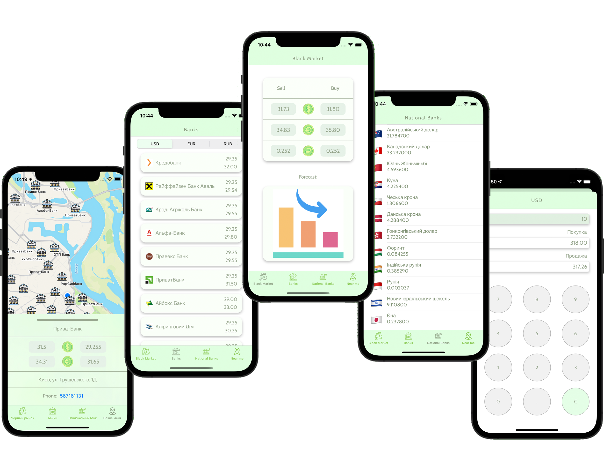

# UAH currency exchange

An ios with an application for tracking the current exchange rate of the uah. Its convenience lies in viewing the uah exchange rates on the black market, Ukrainian banks and the national bank of Ukarine, 
displaying the location of nearby banks, the presence of a calculator will help you calculate the required amount in uah and vice versa
## Screenshots

## UI Design

[Go to the figma project](https://www.figma.com/file/XBjnv9PdNn5hO2P5KnivNU/Exchange-rate-ios-app?node-id=0%3A1)
## Stack

- MVP
- MapKit
- sqlLite
- CoreAnimation
- CoreLocation
- GCD
- RestAPI
- Cordinator
## Used pods

- SwiftMessages
- lottie-ios
- FMDB/SQLCipher
- SwiftGen

## Authors

- [@a-koldunova](https://github.com/a-koldunova)
- [@tkoldunova](https://github.com/tkoldunova)
